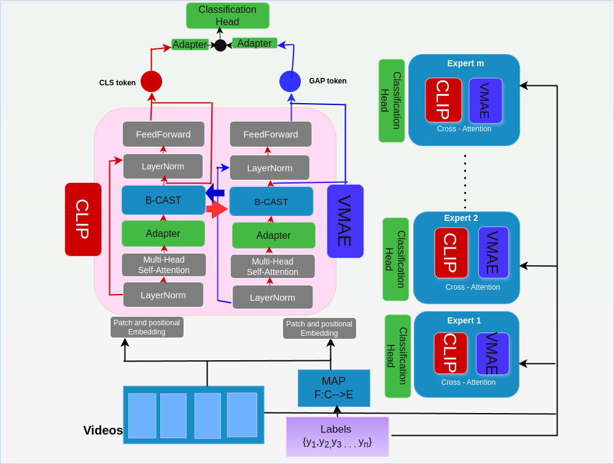

# TSTL: Two Stage Transformer Learning


<br>


[](https://paperswithcode.com/sota/action-recognition-on-epic-kitchens-100?p=cast-cross-attention-in-space-and-time-for-1)

<br>
<br>

<br>


# :wrench: Installation

We conduct all the experiments with NVIDIA GeForce RTX A6000 GPUs.
First, install PyTorch and torchvision

```
conda create -n vmae_1.10  python=3.8 ipykernel -y
conda activate vmae_1.10
conda install pytorch torchvision torchaudio -c pytorch
```
Then, install timm, triton, DeepSpeed, and others.
```
pip install triton
pip install timm
git clone https://github.com/microsoft/DeepSpeed
cd DeepSpeed
pip install deepspeed
pip install TensorboardX decord einops scipy pandas requests

```

For  Deepspeed-related issues, please refer to the [DeepSpeed GitHub page](https://github.com/microsoft/DeepSpeed).


# :file_folder: Data Preparation

 * We report experimental results on two standard datasets.( [Something-Something-V2](https://developer.qualcomm.com/software/ai-datasets/something-something), [UCF101]())
 * We provide sample annotation files -> [annotations](./annotations/).


### Something-Something-V2
- The pre-processing of **Something-Something-V2** can be summarized into 3 steps:

  1. Download the dataset from [official website](https://developer.qualcomm.com/software/ai-datasets/something-something).

  2. Preprocess the dataset by changing the video extension from `webm` to `.mp4` with the **original** height of **240px**. You can refer to [MMAction2 Data Benchmark](https://github.com/open-mmlab/mmaction2).

  3. Generate annotations needed for dataloader ("<video_id> <video_class>" in annotations). The annotation usually includes `train.csv`, `val.csv` and `test.csv`. The format of `*.csv` file is like:

     ```
     video_1.mp4  label_1
     video_2.mp4  label_2
     video_3.mp4  label_3
     ...
     video_N.mp4  label_N
     ```
  4. All video files are located inside the DATA_PATH.

# Expert model preparation
We use the pre-trained weights of spatial and temporal experts. The pretrained weight of the spatial expert (CLIP) uses the [official weight](https://openaipublic.azureedge.net/clip/models/5806e77cd80f8b59890b7e101eabd078d9fb84e6937f9e85e4ecb61988df416f/ViT-B-16.pt). The pre-trained weight of the temporal expert (VideoMAE) uses the pre-trained weights from the two datasets SSV2 and UCF101.[SSV2](https://drive.google.com/file/d/1dt_59tBIyzdZd5Ecr22lTtzs_64MOZkT/view?usp=sharing) and [UCF101](https://drive.google.com/file/d/1BHev4meNgKM0o_8DMRbuzAsKSP3IpQ3o/view) use the [official weights](https://github.com/MCG-NJU/VideoMAE/blob/main/MODEL_ZOO.md) Put each downloaded expert weight into the VMAE_PATH and CLIP_PATH of the fine-tune script.


# Fine-tuning TSTL

We provide the **off-the-shelf** scripts in the [scripts folder](scripts).

-  For example, to fine-tune CAST on **UCF101** :

  ```bash
DATA_PATH=YOUR_PATH
VMAE_MODEL_PATH=YOUR_PATH
CLIP_MODEL_PATH=YOUR_PATH


OMP_NUM_THREADS=1 python -m torch.distributed.launch \
    --nproc_per_node=2 \
    --master_port ${YOUR_NUMBER} --nnodes=8 \
    --node_rank=${YOUR_NUMBER} --master_addr=${YOUR_NUMBER} \
    YOUR_PATH/run_bidirection.py \
    --data_set UCF101 \
    --nb_classes 101 \
    --vmae_model compo_bidir_vit_base_patch16_224 \
    --anno_path ${ANNOTATION_PATH}
    --data_path ${DATA_PATH} \
    --clip_finetune ${CLIP_MODEL_PATH} \
    --vmae_finetune ${VMAE_MODEL_PATH} \
    --log_dir ${YOUR_PATH} \
    --output_dir ${YOUR_PATH} \
    --batch_size 8 \
    --input_size 224 \
    --short_side_size 224 \
    --save_ckpt_freq 2 \
    --num_sample 1 \
    --num_frames 16 \
    --opt adamw \
    --lr 1e-3 \
    --opt_betas 0.9 0.999 \
    --weight_decay 0.05 \
    --epochs 30 \
    --dist_eval \
    --test_num_segment 5 \
    --test_num_crop 3 \
    --num_workers 8 \
    --drop_path 0.2 \
    --layer_decay 0.75 \
    --mixup_switch_prob 0 \
    --mixup_prob 0.5 \
    --reprob 0. \
    --init_scale 1. \
    --update_freq 6 \
    --seed 0 \
    --enable_deepspeed \
    --warmup_epochs 5 \
  ```


Evaluation commands for the SSV2, UCF101
```
python ./run_bidirection.py --fine_tune {YOUR_FINETUNED_WEIGHT} --eval
```


## Acknowledgements

This project is built upon [VideoMAE](https://github.com/MCG-NJU/VideoMAE),  [CLIP](https://github.com/openai/CLIP) and [CAST](https://github.com/KHU-VLL/CAST.git). Thanks to the contributors of these great codebases.

## License

This project is under the CC-BY-NC 4.0 license. See [LICENSE](https://github.com/MCG-NJU/VideoMAE/blob/main/LICENSE) for details.


